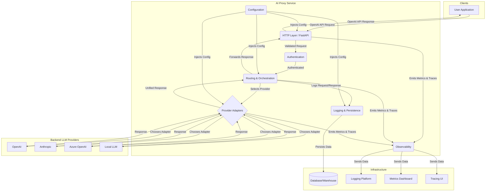

# AI Proxy Service: Project Plan

This document outlines the project plan for building a robust, production-ready AI Proxy Service. The service will act as a drop-in replacement for the OpenAI API, routing requests to various LLM backends while providing comprehensive logging, security, and observability.

## 1. High-Level Architecture

The system is designed to be modular, scalable, and maintainable, leveraging modern Python practices and libraries.

### Core Components



*   **HTTP Layer (FastAPI)**: The public-facing entry point. It handles raw HTTP requests, validates them against OpenAI's API schema using Pydantic, and serves responses.
*   **Authentication (API Keys)**: A middleware layer that validates incoming API keys before passing requests to the core logic.
*   **Routing & Orchestration**: The brain of the service. It receives validated requests, decides which backend provider to use based on configuration, and invokes the appropriate adapter.
*   **Provider Adapters**: A collection of pluggable modules, each responsible for translating the OpenAI-formatted request into the specific format required by a backend LLM provider (e.g., Anthropic, Azure) and translating the provider's response back into the OpenAI format.
*   **Logging & Persistence**: A dedicated layer that captures every request, response, latency, token usage, and other metadata. It logs this information in a structured format and persists it to a database for analysis.
*   **Configuration**: Manages all service settings, including provider endpoints, credentials, and routing rules. Sourced from environment variables and/or configuration files.
*   **Observability**: Integrates with standard tooling (OpenTelemetry) to emit structured logs, metrics (e.g., request latency, error rates), and traces for monitoring and debugging.

### Technology Stack

*   **Web Framework**: [FastAPI](https://fastapi.tiangolo.com/) for its high performance, async support, and automatic data validation with Pydantic.
*   **HTTP Client**: [HTTPX](https://www.python-httpx.org/) for asynchronous requests to backend providers.
*   **Data Validation/Serialization**: [Pydantic](https://docs.pydantic.dev/) for defining and validating API models.
*   **Logging**: Standard `logging` module with [Structlog](https://www.structlog.org/en/stable/) for structured, context-rich logging.
*   **Observability**: [OpenTelemetry Python](https://opentelemetry.io/docs/instrumentation/python/) for vendor-agnostic tracing and metrics.
*   **Database**: Start with SQLite for simplicity in Phase 1, then move to [PostgreSQL](https://www.postgresql.org/) for robust transactional logging. For very high-volume analytics, consider a columnar store like [ClickHouse](https://clickhouse.com/).
*   **Dependency Management**: `pyproject.toml` with [Poetry](https://python-poetry.org/) or [PDM](https://pdm-project.org/).

## 2. API Surface

The primary goal is to be a drop-in replacement for `api.openai.com`.

### OpenAI Compatible Endpoints

*   `POST /v1/chat/completions`: For generating chat-based completions.
*   `POST /v1/embeddings`: For creating vector embeddings from text.
*   *Future*: `POST /v1/completions` (legacy), `GET /v1/models`.

**Example `chat/completions` Payload:**

```json
{
  "model": "gpt-4",
  "messages": [
    {
      "role": "system",
      "content": "You are a helpful assistant."
    },
    {
      "role": "user",
      "content": "Hello!"
    }
  ],
  "temperature": 0.7,
  "stream": false
}
```

### Internal/Admin Endpoints

*   `GET /health`: Simple health check endpoint. Returns `{"status": "ok"}` and a `200` status code if the service is operational.
*   `GET /metrics`: Exposes metrics in a Prometheus-compatible format.

## 3. Provider Abstraction Layer

### Adapter Strategy

We will use a Strategy design pattern. A central `ProviderFactory` will select the appropriate adapter based on the incoming request or routing configuration. Each adapter will be a class that inherits from a common `BaseProvider` abstract base class (ABC).

```python
# pseudo-code
from abc import ABC, abstractmethod

class BaseProvider(ABC):
    def __init__(self, credentials):
        self.client = self._create_client(credentials)

    @abstractmethod
    def create_chat_completion(self, request_data: dict) -> dict:
        """Translates, sends, and normalizes a chat completion request."""
        pass

    @abstractmethod
    def _create_client(self, credentials):
        """Initializes the provider-specific HTTP client."""
        pass

class OpenAIProvider(BaseProvider):
    def create_chat_completion(self, request_data: dict) -> dict:
        # ... logic to call OpenAI and return a normalized response
        pass

class AnthropicProvider(BaseProvider):
    def create_chat_completion(self, request_data: dict) -> dict:
        # ... logic to translate OpenAI format to Anthropic,
        # call Anthropic, and normalize the response back to OpenAI format
        pass

```

### Configuration

Provider credentials and settings will be managed via environment variables, following 12-factor app principles.

*   `OPENAI_API_KEY=sk-...`
*   `ANTHROPIC_API_KEY=...`
*   `AZURE_OPENAI_ENDPOINT=...`
*   `AZURE_OPENAI_API_KEY=...`

## 4. Logging & Data Storage

### Logging Schema

Every request-response cycle will be logged as a single structured JSON object.

**Example Schema:**
```json
{
  "log_id": "uuid-v4",
  "timestamp_utc": "iso-8601",
  "direction": "in", // or "out"
  "api_key_hash": "sha256-of-key",
  "endpoint": "/v1/chat/completions",
  "request": {
    "headers": { "...": "..." },
    "body": { "model": "gpt-4", "messages": [...] }
  },
  "response": {
    "status_code": 200,
    "body": { "id": "chatcmpl-...", "choices": [...] }
  },
  "timing": {
    "total_latency_ms": 1250,
    "provider_latency_ms": 1100
  },
  "usage": {
    "prompt_tokens": 50,
    "completion_tokens": 150,
    "total_tokens": 200
  },
  "provider": {
    "name": "openai",
    "model_resolved": "gpt-4-0613"
  },
  "metadata": {
    "trace_id": "opentelemetry-trace-id"
  }
}
```

### Database/Warehouse Choices

*   **Phase 1 (MVP)**: Log to `stdout` as JSON. Pipe to a file for persistence.
*   **Phase 2 (Production)**: Use **PostgreSQL**. Its native `JSONB` type is highly efficient for storing and querying our log schema. It's reliable and well-supported.
*   **Phase 3 (High Scale)**: If analytics performance becomes an issue, migrate data to a columnar warehouse like **ClickHouse** or a cloud service like **Google BigQuery** or **AWS Redshift**.

### GDPR/PII Handling

*   **Anonymization**: Do not log sensitive headers (e.g., `Authorization`). Hash API keys before logging.
*   **Data Redaction**: Implement a configurable redaction layer to scrub PII from request/response bodies before persistence if required by compliance.
*   **Data Retention**: Implement automated data retention policies to delete logs after a configurable period.

## 5. Security & Compliance

*   **Authentication**: All endpoints (except admin ones) will require an API key, passed via the `Authorization: Bearer <key>` header.
*   **Key Management**: Keys will be stored as securely hashed values. The service will perform a constant-time comparison to prevent timing attacks.
*   **TLS**: The service must be deployed behind a reverse proxy (e.g., Nginx, Traefik) that terminates TLS.

## 6. Observability & Reliability

*   **Structured Logs**: All logs will be in JSON format for easy parsing by platforms like Datadog, Splunk, or an ELK stack.
*   **Metrics**: Track key indicators via Prometheus metrics:
    *   `requests_total` (counter, labels: endpoint, provider, status_code)
    *   `request_latency_seconds` (histogram, labels: endpoint, provider)
    *   `token_usage_total` (counter, labels: provider, direction)
*   **Tracing**: Use OpenTelemetry to trace the full lifecycle of a request, from the HTTP layer through the provider adapter and back. This is invaluable for debugging latency issues.
*   **Error Handling**: Implement graceful error handling. Provider timeouts, API errors, or network issues should be caught and returned as valid OpenAI-compatible error responses.
*   **Retries & Timeouts**: Use `httpx` to configure reasonable timeouts for all outbound requests. Implement a configurable retry strategy (e.g., exponential backoff) for transient errors.

## 7. Testing Strategy

*   **Unit Tests**: Test individual functions and classes in isolation (e.g., testing the `AnthropicProvider`'s translation logic). Use `pytest`.
*   **Integration Tests**: Test the interaction between components (e.g., test that a request to the FastAPI endpoint correctly invokes the logging layer).
*   **Contract Tests**: For each provider, have a test that runs against a mocked version of its API to ensure our client is compatible with the expected request/response structure.
*   **Load Tests**: Use a tool like [Locust](https://locust.io/) to simulate traffic and identify performance bottlenecks.

## 8. Deployment & Operations

*   **Containerization**: The application will be packaged as a Docker image. A multi-stage `Dockerfile` will be used to create a lean, secure production image.
*   **CI/CD**: A GitHub Actions (or similar) pipeline will be set up to:
    1.  Run linting and tests on every push/PR.
    2.  Build and push a Docker image on merge to `main`.
    3.  Deploy the new image to staging/production environments.
*   **Configuration Management**: Configuration will be injected via environment variables, compatible with Docker, Kubernetes, and other orchestrators.
*   **Secret Handling**: Secrets (API keys) will be managed using environment variables, which can be populated by a secret management system like HashiCorp Vault, AWS Secrets Manager, or Doppler.

## 9. Project Structure & Coding Standards

### Folder Layout

```
ai-proxy/
├── .github/                # CI/CD workflows
├── .vscode/                # Editor settings
├── ai_proxy/               # Main application source code
│   ├── adapters/           # Provider adapters
│   │   ├── __init__.py
│   │   ├── base.py
│   │   └── openai.py
│   ├── api/                # FastAPI endpoints and schemas
│   │   ├── __init__.py
│   │   └── v1/
│   ├── core/               # Core logic (routing, orchestration)
│   ├── logging/            # Logging configuration and schemas
│   ├── security/           # Authentication and security logic
│   └── main.py             # Application entry point
├── tests/                  # All tests
│   ├── integration/
│   └── unit/
├── .dockerignore
├── .gitignore
├── .pre-commit-config.yaml
├── Dockerfile
├── poetry.lock
├── pyproject.toml
└── README.md
```

### Tooling & Standards

*   **Formatting**: [Black](https://github.com/psf/black) for code formatting, [isort](https://pycqa.github.io/isort/) for import sorting.
*   **Linting**: [Ruff](https://github.com/astral-sh/ruff) for fast, comprehensive linting (replaces Flake8, isort, etc.).
*   **Type Checking**: [Mypy](http://mypy-lang.org/) for static type analysis.
*   **Pre-commit Hooks**: A `pre-commit` configuration will be used to automatically run Black, Ruff, and Mypy before each commit, ensuring all code adheres to our standards.

## 10. Timeline & Milestones

The project will be developed in phases to deliver value incrementally.

### Phase 1: MVP - The Simplest Possible Implementation (ETA: 1-2 weeks)
*Goal: Create a working, containerized service that can proxy one endpoint to one provider.*

*   [x] `[Phase 1]` Setup project structure with `poetry` and `pyproject.toml`.
*   [x] `[Phase 1]` Create a basic FastAPI application.
*   [x] `[Phase 1]` Implement the `POST /v1/chat/completions` endpoint with Pydantic models.
*   [x] `[Phase 1]` Implement a basic `OpenAIProvider` adapter that forwards requests to the official OpenRouter OpenAI compatible API.
*   [x] `[Phase 1]` Implement basic API key authentication (read a single valid key from an env var).
*   [x ] `[Phase 1]` Implement basic structured logging of the request and response to `stdout`.
*   [x] `[Phase 1]` Create a `Dockerfile` to containerize the application.
*   [x] `[Phase 1]` Write a `README.md` with setup and usage instructions.
*   [x] `[Phase 1]` Setup pre-commit hooks with Black and Ruff.
*   [x] `[Phase 1]` **BONUS**: Add HTTPS support with Traefik and Let's Encrypt.

### Phase 2: Production Hardening & Provider Expansion (ETA: 2-3 weeks)
*Goal: Make the service robust, observable, and support a second provider.*

*   [ ] `[Phase 2]` Set up a PostgreSQL database for persistent logging.
*   [ ] `[Phase 2]` Implement the full logging schema and persist logs to the database.
*   [ ] `[Phase 2]` Integrate OpenTelemetry for basic tracing and metrics.
*   [ ] `[Phase 2]` Add `/health` and `/metrics` endpoints.
*   [ ] `[Phase 2]` Implement a second provider adapter (e.g., for Anthropic).
*   [ ] `[Phase 2]` Implement a routing mechanism to select a provider based on the `model` field in the request.
*   [ ] `[Phase 2]` Improve API key handling to support multiple keys from a secure source.
*   [ ] `[Phase 2]` Enhance unit and integration test coverage.
*   [ ] `[Phase 2]` Set up a basic CI/CD pipeline in GitHub Actions.

### Phase 3: Advanced Features & Scalability (ETA: 3-4 weeks)
*Goal: Add features for more complex use cases and ensure scalability.*

*   [ ] `[Phase 3]` Implement the `POST /v1/embeddings` endpoint and adapters.
*   [ ] `[Phase 3]` Add support for streaming responses (`stream=True`).
*   [ ] `[Phase 3]` Implement more advanced routing strategies (e.g., load balancing, fallbacks).
*   [ ] `[Phase 3]` Implement request retries with exponential backoff for provider failures.
*   [ ] `[Phase 3]` Add support for local models via a provider adapter (e.g., for Ollama or LM Studio).
*   [ ] `[Phase 3]` Conduct and analyze load tests to identify and fix bottlenecks.
*   [ ] `[Phase 3]` Create a simple admin UI or CLI for viewing logs and managing keys.
*   [ ] `[Phase 3]` Implement data redaction and retention policies for compliance. 